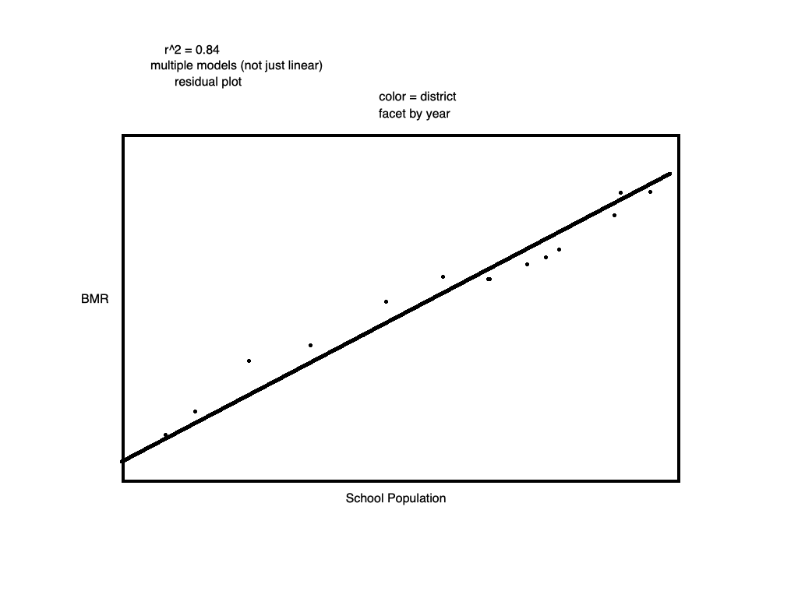

SAt Benchmark Performance in Connecticut
================

## 1\. Introduction

This project uses a primary dataset that contains SAT School
Participation and Performance informations limited to the state of
Connecticut in 2012 and 2013.

This dataset contains data by school on student SAT scores relative to
the SAT College and Career Readiness (CCR) Benchmark score of 1550
(critical reading, mathematics and writing sections combined) for the
graduating classes of 2012 and 2013. According to research conducted by
the College Board, a score of 1550 indicates that a student will have a
65 percent or greater likelihood of achieving a B- average or higher
during the first year of college.

This dataset also provides an estimated SAT Participation Rate, which
equals the number of SAT test-taking seniors in the school divided by
the number of seniors enrolled in the school as a percentage. These
participation rates are considered an estimate because the grade level
of the SAT test-taker is self-reported by the student at the time of
registration for the SAT while the total number of seniors enrolled in
the school is reported to the Connecticut State Department of Education
(CSDE) by the district. These are the best available estimates of SAT
participation rates.

The Benchmark Performance reflect the results of only those who
participate in the SAT. Because participation rates vary from school to
school, the CSDE provides both the estimated Participation rates
together with the Benchmark Performance in order to promote fair and
valid comparisons across schools.

So I would like to use a new index: Benchmark Meeting Rate(BMR) to
compare Benchmark Performance among all schools and districts related to
the dataset.This index equals the number of Benchmark-meeting seniors in
a school divided by the number of seniors enrolled in the school as a
percentage.

This report will try to analyze the distribution of Benchmark
Performance and its trend among the schools in Connecticut in 2012 and
2013 , then give some improving suggestions.

